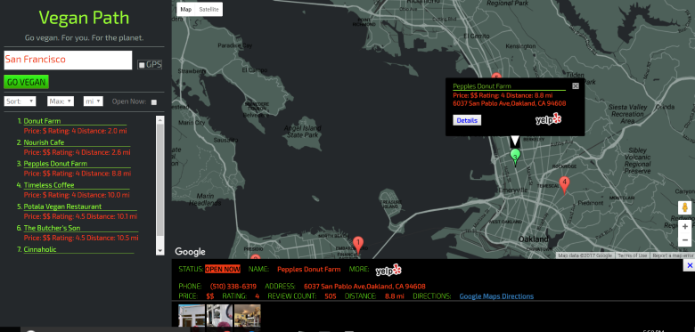
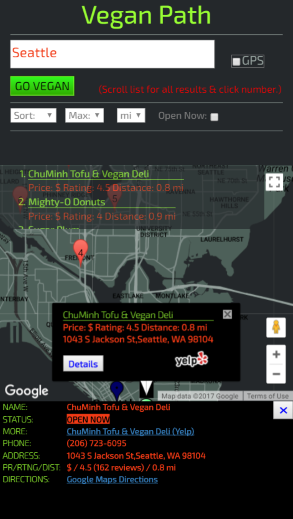
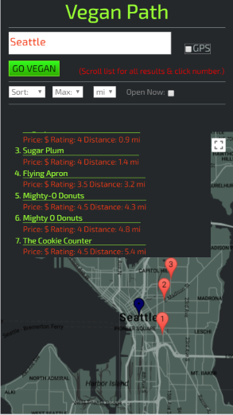

# Vegan Path


>Vegan Path is an application which integrates Google Maps data with business  
review queries from Yelp to assist vegan/vegetarian travelers or anyone else  
seeking vegan/vegetarian businesses (mostly in the form of restaurants)  
wherever they might be.  

Given a target location of interest, Vegan Path will pin-point vegan  
businesses, along with their distance from the indicated location  
and Yelp price and review ratings.

Optionally, business-specific queries may be executed for detailed review  
information (including photos, where available) and a Google Maps direction  
link is provided to facilitate transportation/directions explanation from  
the user-provided search location to the selected restaurant/point of interest.  


### Screenshot:



### Note

This application queries the Yelp Fusion API from the front-end, which poses  
its own unique set of challenges.  Please refer to the **Additional Information**    
section at the end of this document in which I detail how I integrated Yelp  
queries for requests originating client-side.  


## Setup & Installation

### Requirements

This application uses a minimal Python back-end and the Flask micro-framework  
which are used only to serve the main html document "index.html" and the    
server-side client credentials file.  As such, Python and Flask are required  
components in the application environment.  

Besides jQuery, this application makes use of the Bootstrap front-end framework  
whose grid scaffolding is used for layout purposes and the KnockoutJS  
organizational library as the model view controller (MVC).  

With the exception of the modified Bootstrap CSS, these components may be  
sourced from any CDN.  


### Setup

Either download the zip archive and uncompress it to a suitable location and/or  
git clone the repository to a desired target location.

The resulting directory structure follows a standard Flask application setup  
with the familiar templates and static directories as follows:

```
.
├── app.py
├── README.md
├── requirements.txt
├── templates/
|   └── index.html
└── static/   
    └── assets/
    |    ├── css/
    |    |   ├── flex.css	    
    |	 |   └── main.css
    |    ├── docs/
    |	 |   ├── credentials
    |    |   └── screenshot_laptop.PNG	   		
    |	 |       ├── screenshot_mobile.PNG
    |	 |       └── screenshot_mobile2.PNG
    |    ├── img/
    |	 |   └── icons/
    |	 |       ├── favicon.ico
    |	 |       └── logos/
    |	 |    	     └── yelp_logo.png
    |    └── js/ 
    |	 |   ├── defMap.js
    |	 |   ├── fusion.js
    |	 |   ├── map.js
    |	 |   └── showMarkers.js
    |	 └── json/ 
    |	     └── vegMapStyle.json
    |	 
    └── lib/
        └── bootstrap/
            └── bootstrap.min.css

```

Note that the credentials file is a critical component as it contains the  
required credentials for APIs in the application (Google Maps and Yelp) and  
which for security reasons is kept server-side, to avoid exposing these.  

*For full functionality, substitute valid credentials arguments in this file.  
Required credentials include: Google Maps API Key, Yelp client id, and  
Yelp client secret.* 

The *requirements.txt* file lists a complete set of packages and dependencies  
required to run this application.  These may be conveniently installed  
by running:

```
pip install -r requirements.txt
```

from the command line.  

The following command will run the application:

```
python app.py
```

This will run with the Flask webserver serving the app on localhost.  
By default, the application is served to port 5000.  This may be modified  
by editing the symbolic constant 'PORT' in the file "app.py."

*(Note: production-grade rollouts would require configuration in scalable  
web servers such as Apache or Nginx which this project in its current form  
is not configured to do).*


## Usage

Upon initialization, the application will present a map, which will take up  
the majority of screen space, and a navigational control area in which the  
user specifies locations and may subsequently filter results.  

A default map (currently set to New York, USA) is initialized.  The default  
location in the landing map may be changed by editing the DEF_LAT and DEF_LNG  
symbolic constants in the file defMap.js to match those of the desired  
location.  

For smaller (mobile) displays, the navigation/control area will occupy the  
top of the screen whereas for larger displays (tablet and greater) the  
control area comprises a panel occupying roughly the left third of the screen.  


### Functionality

1). Enter a search location in the form of a street address or city name  
in the search bar.  This will localize the geographic search area for both  
Google Maps and the Yelp API queries.  

The user's current geo-coordinates may be substituted by checking the "GPS"  
checkbox.  When checked, an alert in the form of a confirmation box will  
appear.  Click 'OK' to confirm use of GPS (or 'Cancel', otherwise).

Click the 'GO VEGAN' button to launch the query.

2). If the location is found, the *maparea* display of the application will  
update to display the Google Map of the indicated location.

A Yelp query will be executed and markers in the form of pink paddles  
corresponding to each business location will display on the map.  A blue marker  
represents the origin as indicated by the user.

Clicking on a marker will highlight that marker, changing its color to green.  
An information window will also appear with summary information on the business  
in the window.  


### Businesses-specific data

The user may click the "Details" button within any marker's information window  
to launch a business detail pane which will include additional business  
specific detail (including phone and address information).  This information  
is obtained by issuing a separate business query to the Yelp API.  

Within the business details pane, users have the option of clicking the Yelp  
icon to be redirected to that business's Yelp page for more information on  
the point of interest.  In addition, a Google Maps Directions link is provided  
which users may click to automatically query directions from the origin to the  
selected business location, if desired.  

For larger displays (tablet and larger), a list is generated which will appear  
under the navigation/filter controls.  Clicking on any of the business which  
appear in the list will highlight the corresponding marker on the map and  
open its information window.  Additionally, a business-specific query will be  
sent to Yelp and the business details pane will display automatically for the  
clicked item.  

For mobile displays, a translucent scrollable listbox will appear at the top of  
the maparea.  If the number of results returned is more than one, a message  
will alert the user that the box is scrollable.  When hovered over, the box  
will expand and become opaque to assist in selecting a location from the list.  
When clicked off, the mobile listings box will shrink back to its original  
size and become translucent again.  


### Mobile screenshot:
  <====> 

  
### Sort Criteria

The markers are numbered in descending preferential rank format with the  
default sort being distance (ascending order) from the origin marker.  

To change the sort criteria, select one of the options in the sort select box  
in the navigation/control area.  Selecting "Price" will rerank the markers  
according to Yelp price rankings in ascending order and "Ratings" will rerank  
the markers according to Yelp review ratings in descending order.  


### Options/Filters

A maximum distance filter may also be applied by selecting an option other than  
"Max" in the distance drop down box.  Markers will be automatically re-ranked  
with only qualifying locations included in the result set.  

Distance display options include "mi" for miles or "km" for kilometers.  
Changing this will update the displayed results automatically.  

With the exception of the **Open Now** criteria, any/all sort/filter/options  
are automatically updated.  Alternating the check of the "Open Now" criteria,  
however, requires a new query to be sent to the Yelp API.  This is because  
Yelp requires this query to be explicitly specified for its general search  
queries.  

The default value is set to "on" to return business open at the time  
of querying by the user.  


### Messages

Messages are displayed in the message area, which is found at the top  
of the navigation/control tools.  Possible messages and their meanings are  
as follows:

1). "Required: address/loc or GPS"

Appears when a query is attempted and no location is indicated, either in the  
address bar or in the form of GPS.  This can be corrected by inputting a  
location in the search bar or by using the GPS option.

2). "Location not found"

Appears when the location could not be identified by the query sent to Google  
Maps.  Note the *maparea* will correspondingly dim in opacity.  

3). "No results returned"

Appears when no Yelp businesses are returned for the given address plus filter  
combination criteria.  When this happens, you can try broadening the search  
either by leaving the maximum distance filter on "Max" or modifying the indicated 
location.  

4). "(Rerun required)"

Appears when the "Open Now" checkbox is alternately checked.  Simply refresh  
the results by pressing the "GO VEGAN" button.  This functionality is due to  
an inherent feature of the Yelp API query, which requires this parameter to be  
specified for business queries.  

*(See Additional Information: Known Issues for a note on Fusion's behavior  
with this parameter).*


## Additional Information

### Querying Yelp's Fusion API from the client

As of April 2017, Yelp sunset its previous API (version 2.0) as part of its  
campaign to migrate developers to its new (version 3.0) API, known as 'Fusion'.  

Unlike Yelp's previous API, Fusion was developed primarily as a server-side  
API and does not support CORS headers or JSONP requests, resulting in  
cross-origin resource sharing violations for requests originating client-side.  
Yelp's own developers admit this and the lack of a JavaScript approach to  
querying its API [in this thread](https://github.com/Yelp/yelp-api/issues/51).  

Complicating the issue is the fact that Yelp requires a bearer authentication  
token to be sent in order for API requests to be fulfilled (itself predicated  
on previously obtained client credentials).  However, if exposed, the token may  
be used by unauthorized parties against the original client's quota, thus posing  
an ostensible security issue.  

Determined to come up with a workable method to integrate Yelp reviews for  
businesses (and to query/process these, with less time expenditure, right in the  
browser) I came up with the following workaround solution:  

1). I use heroku's corsanywhere utility, which acts as a reverse proxy, to query    
Yelp Fusion, adding CORS headers to the request as it does so, thus avoiding CORS   
violations/conflicts.  More can be read about this tool [here](https://github.com/Rob--W/cors-anywhere).  

2). I store all client credentials (including Yelp client credentials and  
Google API keys) server-side in order to avoid exposure of these. For Yelp  
Fusion API requests, I query a salted version of the required bearer-token  
from my application and evaluate the actual token only upon sending the request  
to Fusion, thus avoiding the need to store the token in the browser whether in  
the form of cookies or local/session storage.  While this is far from a foolproof  
approach, it works for the purposes of this application.

I detail this approach in a write-up on my github page [here](https://github.com/builderLabs/Yelp-Fusion-JavaScript/blob/master/yelpFusionJS.md).

More can be found on this discussion in this Udacity forums [thread](https://discussions.udacity.com/t/yelp-v3-implementation/235928/33).


### Known Issues

A known characteristic of the Yelp Fusion is its erratic behavior in returning  
query results which Yelp developers have attributed to "periodic reindexing".  

One manifestation of this behavior is in use of the Open Now parameter, which    
is meant to return businesses open at the time of inquiry.  Occasionally, Yelp  
Fusion has returned result sets which are larger when the Open Now parameter is  
set to true, contrary to expectations.  

One such discussion of erratic/inconsistent query results from Fusion may be  
found [here](https://github.com/Yelp/yelp-fusion/issues/197).  


### Other

The map in this application makes use of a modified version of the map called  
"Assasin's Creed IV" by Sarah Frisk as sourced from SNAZZY MAPS.  

See [here](https://snazzymaps.com/) for more information.  
